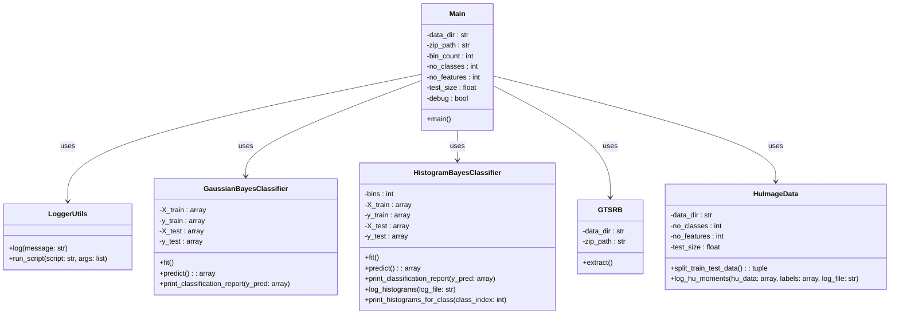

# Traffic Sign Classification Project Using Bayes Classifier

The purpose of this program is to process data from the German Traffic Sign Recognition Benchmark (GTSRB) and train two classification models: Gaussian Bayes and Histogram Bayes. The models are evaluated and their performance is logged.

## Table of Contents
1. [Project Structure](#project-structure)
2. [Installation and Environment Setup](#installation-and-environment-setup)
   - [Required Modules](#required-modules)
   - [Windows](#windows)
   - [Unix/Linux](#unixlinux)
3. [Running the Project](#running-the-project)
   - [control/main.py](#controlmainpy)
4. [Detailed Program Operation](#detailed-program-operation)
   - [Step 1: Extracting Data](#step-1-extracting-data)
   - [Step 2: Data Processing](#step-2-data-processing)
   - [Optional Step: Visualizing Sample Data](#optional-step-visualizing-sample-data)
   - [Step 3: Training Gaussian Bayes Classifier](#step-3-training-gaussian-bayes-classifier)
   - [Step 4: Training Histogram Bayes Classifier](#step-4-training-histogram-bayes-classifier)
   - [Optional Step: Visualization of Histograms for a Given Class](#optional-step-visualization-of-histograms-for-a-given-class)
   - [Step 5: Classification - Parametric Bayesian ML Classifier](#step-5-classification-parametric-bayesian-ml-classifier)
   - [Step 6: Classification - Non-parametric Bayesian Classifier](#step-6-classification-non-parametric-bayesian-classifier)
5. [Progress monitoring log file](#progress-monitoring-log-file)
   - [Description](#description)
   - [Example Content of `main.log`](#example-content-of-mainlog)
6. [Classification Report - Example](#classification-report-example)
   - [Model Performance](#model-performance)
   - [Performance for Individual Classes](#performance-for-individual-classes)
7. [Log Files](#log-files)
   - [Generated Log Files](#generated-log-files)
     - [`g_classifier_predictions.log`](#g_classifier_predictionslog)
     - [`h_classifier_predictions.log`](#h_classifier_predictionslog)
     - [`hu_moments.log`](#hu_momentslog)
     - [`histograms.log`](#histogramslog)
   - [Log File Examples](#log-file-examples)
8. [Class Diagram](#class-diagram)
9. [Description of project files](#description-of-project-files)
   - [`control/logger_utils.py`](#controllogger_utilspy)
   - [`debug/debug_visualize_samples.py`](#debugdebug_visualize_samplespy)
   - [`problem/gtsrb.py`](#problemgtsrbpy)
   - [`problem/hu_image_data.py`](#problemhu_image_datapy)
   - [`setup/setup.bat`](#setupsetupbat)
   - [`setup/setup.sh`](#setup/setupsh)
   - [`method/gaussian_bayes.py`](#methodgaussian_bayespy)
   - [`method/histogram_bayes.py`](#methodhistogram_bayespy)

## Project Structure

    BayesianTrafficSignClassifier
    │
    ├── control
    │   ├── __init__.py
    │   ├── logger_utils.py
    │   └── main.py
    │
    ├── debug
    │   └── debug_visualize_samples.py
    │
    ├── method
    │   ├── __init__.py
    │   ├── gaussian_bayes.py
    │   └── histogram_bayes.py
    │
    ├── problem
    │   ├── __init__.py
    │   ├── gtsrb.py
    │   ├── hu_image_data.py
    │   └── data
    │       └── GTSRB
    │           └── gtsrb.zip
    │
    ├── setup
    │   ├── requirements.txt
    │   ├── setup.bat
    │   └── setup.sh
    │
    ├── .gitattributes
    ├── .gitignore
    └── README.md

Below is a brief description of the main directories and files:

- **control**: Contains the main control scripts of the project.
  - `__init__.py`: Initialization file for the control module.
  - `logger_utils.py`: Helper functions for logging, setting log formatting, log levels, and mechanisms for saving logs to files or displaying them on the console.
  - `main.py`: Main script for running the classifier. Includes logic for initialization, data loading, model training, and evaluation of results.

- **debug**: Contains scripts for debugging.
  - `debug_visualize_samples.py`: Script for visualizing data samples for debugging purposes. Helps understand the input data and verify the correctness of data processing.

- **method**: Contains the implementation of Bayes methods.
  - `__init__.py`: Initialization file for the method module.
  - `gaussian_bayes.py`: Contains the implementation of the parametric ML Bayes classifier (assuming normal distribution). This classifier uses the assumption that features follow a normal distribution to calculate class probabilities.
  - `histogram_bayes.py`: Contains the implementation of the non-parametric Bayes classifier (multidimensional histogram). This classifier is based on histograms of features, using feature distributions to calculate class probabilities.

- **problem**: Contains files and data specific to the problem.
  - `__init__.py`: Initialization file for the problem module.
  - `gtsrb.py`: Methods for handling GTSRB data.
  - `hu_image_data.py`: Methods for handling image data with Hu moments, extracting Hu moments from traffic sign images, and splitting the data into training and test sets.
  - **data/GTSRB**: Directory containing the GTSRB (German Traffic Sign Recognition Benchmark) data. This data is used to train and test the classification models.
    - `gtsrb.zip`: Compressed file with the GTSRB dataset.

- **setup**: Contains installation scripts and the requirements file.
  - `requirements.txt`: List of dependencies required for the project.
  - `setup.bat`: Batch script for Windows to install dependencies and set up the environment.
  - `setup.sh`: Shell script for Unix/Linux to install dependencies and set up the environment.


## Installation and Environment Setup

### Required Modules
The `requirements.txt` file contains all the required packages and their versions necessary to run the project.

To handle the setup of a virtual environment along with the installation of the necessary modules, use the `setup.bat` or `setup.sh` scripts.

### Windows

1. Run `setup/setup.bat`.
2. The script will check if a virtual environment exists, and if not, it will create a new one.
3. The virtual environment will be activated.
4. A list of installed packages will be displayed before and after the installation of new packages.
5. Packages from `requirements.txt` will be installed.
6. Instructions for running the main script and deactivating the virtual environment will be displayed.

### Unix/Linux

1. Run `setup/setup.sh`.
2. The script will check if a virtual environment exists, and if not, it will create a new one using:
    ```
    python3 -m venv
    ```
3. The virtual environment will be activated via:
    ```
    source venv/bin/activate.
    ```
4. A list of installed packages will be displayed before and after the installation of new packages.
5. Packages from `requirements.txt` will be installed.
6. Instructions for running the main script and deactivating the virtual environment will be displayed.

Alternatively, you can manually install the required libraries using pip:
```
pip install -r setup/requirements.txt
```

## Running the Project

Run the main script, which will execute all the project steps:
```
python control/main.py
```

### control/main.py

The main script initiates the data processing and model training process.

#### Parameters:

- `bin_count` (int): Number of bins for the histogram model.
- `data_dir` (str): Path to the data directory.
- `zip_path` (str): Path to the zip file containing the data in the format train/class_dir.
- `debug` (bool): Flag to enable debugging mode.
- `no_classes` (int): Number of traffic sign classes. (default: 5 - due to the project's size limit of 20 MB)
- `no_features` (int): Number of features to use from Hu moments. (default: 7 - number of Hu moments)
- `test_size` (float): Fraction of data reserved for the test set. (default: 0.2)
- `bin_count` (int): Number of bins for the histogram model. (default: 10)
- `clean` (bool): Flag to enable cleaning mode.

#### Arguments:

- `--data_dir`: Directory containing the data.
- `--zip_path`: Path to the zip file with compressed data in the format train/class_dir.
- `--debug`: Enables debugging mode for data visualization.
- `--test_size`: Fraction of data for the test set (between 0.01 and 0.99).
- `--no_classes`: Number of classes. (dependent on the amount of available data/classes)
- `--no_features`: Number of features (Hu moments) to use (between 1 and 7).
- `--bin_count`: Number of bins for the histogram model.
- `--clean`: Enables cleaning mode for files generated during data processing.

Here is an example of running with arguments:
```
python control/main.py --clean --debug --test_size 0.2 --no_classes 5 --no_features 7 --bin_count 10
```

## Detailed Program Operation

The program processes the data and trains two classification models, monitoring the entire process through logging. Below is a detailed description of each step.

### Step 1: Extracting Data

```
logger.log("Step 1: Extracting GTSRB data started.")
gtsrb = GTSRB(data_dir, zip_path)
gtsrb.extract()
```

**Description:** Extracting data from the zip file containing the German Traffic Sign Recognition Benchmark (GTSRB) resources

**Actions:**

- Initialize the GTSRB object with the data directory path and the zip file path.
- Extract the zip file to the specified directory.

**Logging:** Record the start of the data extraction operation.

### Step 2: Data Processing

```
logger.log("Step 2: Preprocessing data started.")
hu_image_data = HuImageData(data_dir, no_classes, no_features, test_size)
X_train, X_test, hu_train, hu_test, y_train, y_test = hu_image_data.split_train_test_data()
hu_image_data.log_hu_moments(hu_train, y_train, os.path.join(log_dir, 'hu_moments_log.txt'))
print(f'Train Hu moments size: {hu_train.shape[0]}, Test Hu moments size: {hu_test.shape[0]}')
print("Data preprocessing complete. Hu moments logged to", log_file)
```

**Description:** Processing data, including calculating Hu moments, splitting into training and test sets, and logging results.

**Actions:**

- Initialize the HuImageData object with data from the directory, number of classes, number of features, and test set size.
- Split the data into training and test sets and calculate Hu moments.
- Log the Hu moments for the training set.
- Display information about the sizes of the training and test sets.

**Logging:** Record the start of data processing and log Hu moments to the `hu_moments_log.txt` file.

### Optional Step: Visualizing Sample Data

```
if debug:
    logger.log("Optional Step: Visualizing sample data started.")
    logger.run_script('debug/debug_visualize_samples.py', args=[data_dir])
```

**Description:** Visualize sample data (optional, depending on debugging mode).

**Actions:**

- Record the start of data visualization.
- Run the debug/debug_visualize_samples.py script to visualize data samples.

**Logging**: Record the start of the optional visualization step.

### Step 3: Training Gaussian Bayes Classifier (assuming normal distribution)

```
logger.log("Step 3: Training Gaussian Bayes model started.")
g_classifier = GaussianBayesClassifier(X_train=hu_train, y_train=y_train, X_test=hu_test, y_test=y_test)
g_classifier.fit()
```

**Description:** Train the Gaussian Bayes classifier assuming normal distribution.

**Actions:**

- Initialize the GaussianBayesClassifier object with training and test data.
- Train the model on the training set.

**Logging:** Record the start of training the Gaussian Bayes classifier.

### Step 4: Training Histogram Bayes Classifier (non-parametric)

```
logger.log("Step 4: Training Histogram Bayes model started.")
h_classifier = HistogramBayesClassifier(bins=bin_count, X_train=hu_train, y_train=y_train, X_test=hu_test, y_test=y_test)
h_classifier.fit()
h_classifier.log_histograms(log_file=os.path.join(log_dir, 'train_histograms.txt'))
```

**Description:** Train the Histogram Bayes classifier (non-parametric).

**Actions:**

- Initialize the HistogramBayesClassifier object with training and test data.
- Train the model on the training set.

**Logging:** Record the start of training the Histogram Bayes classifier.

### Optional step: Visualization of Histograms for a Given Class

```
if debug:
    logger.log("Optional Step: Visualizing sample histogram started.")
    h_classifier.print_histograms_for_class(1)
```

**Description:** Visualization of histograms for a selected class (optional, depending on debug mode).

**Actions:**

- Logging the start of histogram visualization.
- Displaying histograms for class 1.

**Logging:** Logging the start of the optional step of histogram visualization.

### Step 5: Classification - Parametric Bayesian ML Classifier

```
y_pred = g_classifier.predict(predict_log_file=os.path.join(log_dir, 'g_classifier_predict_predictions.txt'))
g_classifier.print_classification_report(y_pred)
```

**Description:** Predicting classes on the test set using a parametric Bayesian classifier.

**Actions:**

- Predicting classes for the test set and saving results to the file g_classifier_predict_predictions.txt.
- Displaying the classification report.

**Logging:** Logging prediction results and the classification report.

### Step 6: Classification - Non-parametric Bayesian Classifier

**Description:** Predicting classes on the test set using a non-parametric Bayesian classifier.

**Actions:**

- Predicting classes for the test set and saving results to the file h_classifier_predict_predictions.txt.
- Displaying the classification report.

**Logging:** Logging prediction results and the classification report.

## Summary

The project provides a complete workflow for classifying traffic signs using a Bayes classifier. It includes data extraction, processing, model training, evaluation, and logging. The script is modular, allowing easy modification and debugging, with a focus on logging key steps for monitoring and error tracing.

 
## Progress monitoring log file: `main.log`

### Description

`main.log` is the primary log file that tracks the progress of the entire data processing and model training process, as well as other important operations performed by the program. This file is crucial for monitoring because it contains a chronological record of all significant steps and any errors that occurred during the program's execution.

### Example Content of `main.log`

```
2024-06-13 11:45:12 - Process started.
2024-06-13 11:45:12 - Step 1: Extracting GTSRB data started.
Extracting GTSRB dataset to problem/data/GTSRB/Traffic_Signs/ folder...
Extraction complete.
2024-06-13 11:45:14 - Step 2: Preprocessing data started.
Loaded 2879 images with 2879 labels.
(2879, 64, 64) (2879,)
(2879, 7)
Train set size: 2303, Test set size: 576
Train Hu moments size: 2303, Test Hu moments size: 576
Data preprocessing complete. Hu moments logged to debug/logs\main.log
2024-06-13 11:45:42 - Step 3: Training Gaussian Bayes model started.
2024-06-13 11:45:42 - Step 4: Training Histogram Bayes model started.

Histogram Bayes Classification Report:
              precision    recall  f1-score   support

           0       0.47      0.68      0.56       142
           1       0.54      0.60      0.57       181
           2       0.19      0.27      0.22        48
           3       0.22      0.13      0.16        60
           4       0.44      0.19      0.27       145

    accuracy                           0.44       576
   macro avg       0.37      0.38      0.36       576
weighted avg       0.43      0.44      0.42       576

2024-06-13 11:45:42 - Process completed.
```

## Classification Report - Example

    Gaussian Bayes Classification Report:
                precision    recall  f1-score   support

            0       0.51      0.68      0.58       142
            1       0.51      0.71      0.59       181
            2       0.28      0.31      0.30        48
            3       0.37      0.22      0.27        60
            4       0.35      0.11      0.17       145

        accuracy                           0.47       576
    macro avg       0.40      0.41      0.38       576
    weighted avg       0.44      0.47      0.43       576


## Model Performance
- **Accuracy:** 0.47
  - Accuracy represents the percentage of correctly classified samples out of all samples. In this case, the model correctly classified 47% of all samples.

## Performance for Individual Classes

### Class 0:
- **Precision:** 0.51
  - Precision is the ratio of true positive results to the sum of true positive and false positive results. This means that out of all samples classified as class 0, 51% were correctly classified.
- **Recall:** 0.68
  - Recall is the ratio of true positive results to the sum of true positive and false negative results. This means that out of all actual samples of class 0, 68% were correctly classified as class 0.
- **F1-score:** 0.58
  - F1-score is the harmonic mean of precision and recall. It is a measure of the overall performance of the model for this class.
- **Support:** 142
  - Support is the number of actual occurrences of the class in the test dataset.

## Log Files

### control/logger_utils.py

The `logger_utils.py` file contains the Tee and Logger classes, which manage writing log messages to files and displaying them in the terminal.

## Generated Log Files

### `g_classifier_predictions.log`

**Description:**
This file contains detailed information regarding predictions made by the Gaussian Bayes classifier.

**Content:**
- Prediction details for each sample in the test set.
- Posterior probabilities for each class.
- Conditional probabilities for each feature and class.

**Format:**
Each line contains information for one sample:
- Sample ID, true class, predicted class, posterior probabilities, conditional probabilities.

### `h_classifier_predictions.log`

**Description:**
This file contains detailed information regarding predictions made by the Histogram Bayes classifier.

**Content:**
- Prediction details for each sample in the test set.
- Class probabilities for each sample based on histograms.

**Format:**
Each line contains information for one sample:
- Sample ID, true class, predicted class, class probabilities.

### `hu_moments.log`

**Description:**
This file contains the computed Hu moments for samples belonging to a specific class.

**Content:**
- Computed Hu moments for samples.
- Logged Hu moments for analysis and debugging.

**Format:**
Each line contains Hu moments for one sample:
- Sample ID, Hu moments values.

### `histograms.log`

**Description:**
This file contains histograms for each feature and class.

**Content:**
- Histograms for each feature and class.
- Logged histograms for analysis and debugging.

**Format:**
Each line contains histogram values for one feature:
- Feature index, histogram values for that feature.

## Log File Examples

### Example Entry in `g_classifier_predictions.log`:
```
Sample 0: [  2.16200585   6.99546412   8.97868627   8.7388965   17.76683571
  12.90594896 -17.7310433 ]
Predicted class: 0
Class probabilities: {0: 0, 1: 0, 2: 0, 3: 0, 4: 0}

Sample 1: [  2.67146131   7.13761203   9.67750212   9.70987065 -19.40559961
  13.92897663 -20.4178654 ]
Predicted class: 3
Class probabilities: {0: 3, 1: 3, 2: 3, 3: 3, 4: 3}
```
### Example Entry in `h_classifier_predictions.log`:
```
Sample 0: [  2.16200585   6.99546412   8.97868627   8.7388965   17.76683571
  12.90594896 -17.7310433 ]
Predicted class: 0
Class probabilities: {0: 0.0001115832769177358, 1: 7.402632433244765e-09, 2: 0.0, 3: 1.2183058381188396e-07, 4: 1.914566511006075e-07}

Sample 1: [  2.67146131   7.13761203   9.67750212   9.70987065 -19.40559961
  13.92897663 -20.4178654 ]
Predicted class: 0
Class probabilities: {0: 6.810747944179981e-05, 1: 9.922832670994054e-06, 2: 2.1797952038828098e-05, 3: 2.6278723219514598e-05, 4: 3.2232811716693285e-06}
```
### Example Entry in `hu_moments.log`:
```
Class 0 Hu Moments:
Sample 1 Hu Moments: [  2.43038677   6.09687194   9.14487504   9.12304103 -18.35530063
  12.49486787 -18.47639574]
Sample 2 Hu Moments: [  2.58046413   8.72705975  12.73975729  11.98774375  24.67979376
  16.69358992 -24.40558514]
```
### Example Entry in `histograms.log`:
```
Class 0 histograms:
Feature 0: histogram: [ 6  5 71 99 69 62 74 59 36 43], bin_edges: [1.79549735 1.9165121  2.03752686 2.15854161 2.27955636 2.40057112
 2.52158587 2.64260062 2.76361538 2.88463013 3.00564488]
Feature 1: histogram: [ 40  86 111 140  75  38  21   5   5   3], bin_edges: [ 5.74120241  6.24296646  6.74473052  7.24649458  7.74825864  8.2500227
  8.75178675  9.25355081  9.75531487 10.25707893 10.75884299]
```

### Notes

- Log files are generated at appropriate points in the program's execution, depending on the operations performed.
- The files `g_classifier_predictions.log` and `h_classifier_predictions.log` are generated after predictions are made by the respective classifiers.
- The files `hu_moments.log` are generated during the calculation of Hu moments.
- The files `histograms.log` are generated during the creation of histograms for features and classes.


## Class Diagram

- Main: The main class responsible for project initialization, data loading, model training, and evaluation of results.
- LoggerUtils: The class containing methods for logging and running auxiliary scripts.
- GaussianBayesClassifier: The class implementing a parametric Bayes classifier assuming a normal distribution.
- HistogramBayesClassifier: The class implementing a non-parametric Bayes classifier based on histograms.
- GTSRB: The class responsible for managing GTSRB data, including its extraction.
- HuImageData: The class responsible for processing image data, including calculating Hu moments and splitting the data into training and test sets.




## Description of project files

### `control/logger_utils.py`

Manages logging messages to a file and displaying them in the terminal.

#### Tee Class:
- Captures output and redirects it both to a file and the terminal.

#### Logger Class:
- Manages logging messages to a file and displaying them in the terminal.

### `debug/debug_visualize_samples.py`

Displays image samples with their corresponding Hu moments in debug mode.

#### show_sample_images Function:
- Displays image samples with Hu moments.
- Parameters:
  - `images` (ndarray): Array of images.
  - `labels` (ndarray): Array of class labels.
  - `hu_moments` (ndarray): Array of Hu moments.
  - `num_samples` (int): Number of samples to display (default is 10).

### `problem/gtsrb.py`

Manages unpacking of GTSRB (German Traffic Sign Recognition Benchmark) data from a zip file.

#### GTSRB Class:
- `__init__`: Initializes the class with specified paths for extraction and the zip file.
- `extract`: Extracts the GTSRB data file to the specified folder.

### `problem/hu_image_data.py`

Processes traffic sign images, computes Hu moments, and splits data into training and test sets.

#### HuImageData Class:
- `__init__`: Initializes the class with specified parameters.
- `_normalize_hu_moments`: Normalizes Hu moments using a logarithmic scale.
- `_extract_hu_moments_image_data`: Loads and processes GTSRB data, computing Hu moments for each image.
- `split_train_test_data`: Splits data into training and test sets and saves them to .npy files.
- `log_hu_moments`: Logs Hu moments for each class to a text file.

### `setup/setup.bat`

Installation script for Windows.

#### Functionality:
- Checks if the virtual environment does not exist, and if not, creates a new virtual environment.
- Activates the virtual environment.
- Displays the list of installed packages before and after installing new packages.
- Installs requirements from the requirements.txt file.
- Displays instructions for running the main script and deactivating the virtual environment.

### `setup/setup.sh`

Installation script for Unix systems.

#### Functionality:
- Creates a virtual environment if it does not exist.
- Activates the virtual environment.
- Displays the list of installed packages before and after installing new packages.
- Installs requirements from the requirements.txt file.
- Displays instructions for running the main script and deactivating the virtual environment.

### `method/gaussian_bayes.py`

Bayes classifier using Gaussian distributions to model feature distributions.

#### GaussianBayesClassifier Class:
- `__init__`: Initializes the classifier with training and test data.
- `fit`: Trains the classifier using the training data.
- `predict`: Predicts classes for test data and logs detailed prediction information to a file.
- `print_classification_report`: Prints a classification report based on test data and predictions.
- `_calculate_posterior`: Calculates posterior probability for each class.
- `_calculate_likelihood`: Calculates conditional probability for a given class and example.

### `method/histogram_bayes.py`

Bayes classifier using histograms to model feature distributions.

#### HistogramBayesClassifier Class:
- `__init__`: Initializes the classifier with a specified number of bins for histograms.
- `fit`: Trains the classifier using the training data.
- `log_histograms`: Logs histograms to a text file.
- `predict`: Predicts classes for test data and logs detailed prediction information to a file.
- `print_classification_report`: Prints a classification report based on test data and predictions.
- `_calculate_class_probabilities`: Calculates class probabilities for a single example based on histograms.
- `print_histograms_for_class`: Prints histograms for all features for a specified class.
